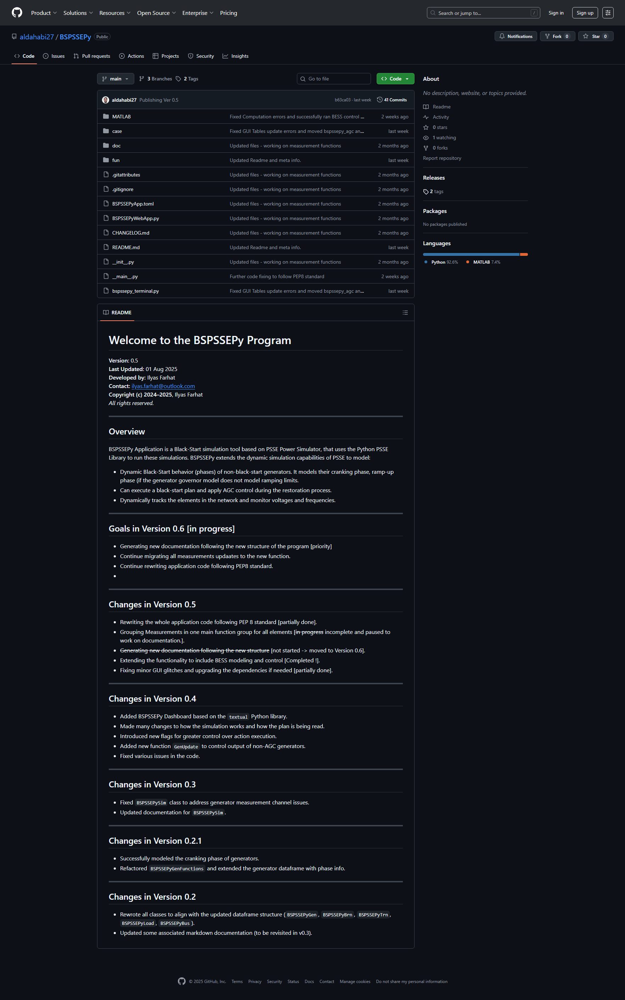
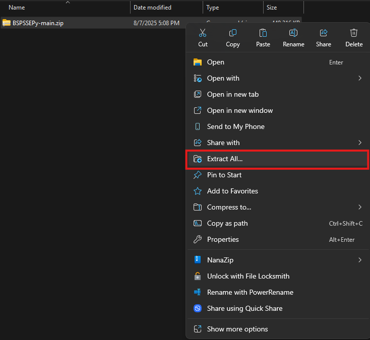
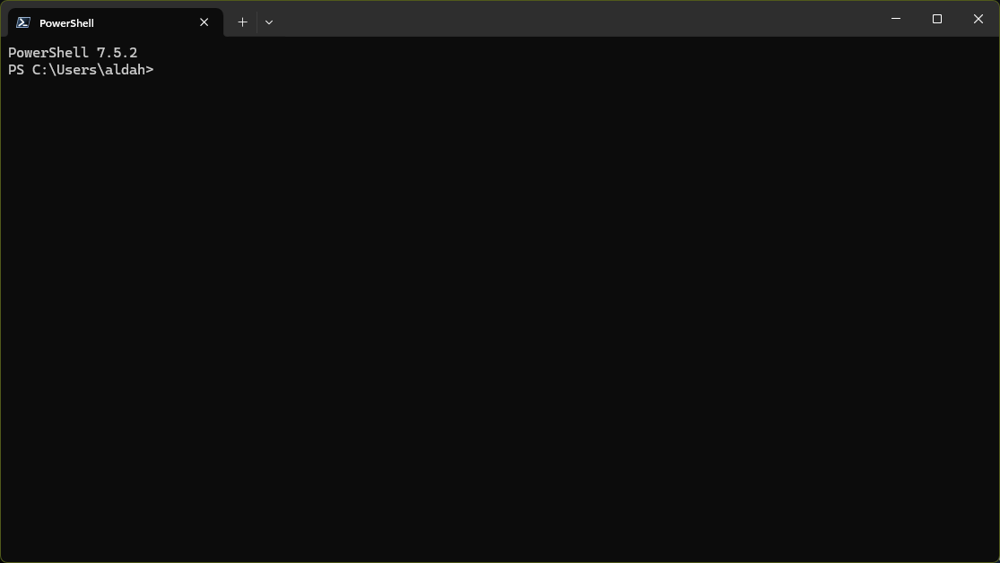
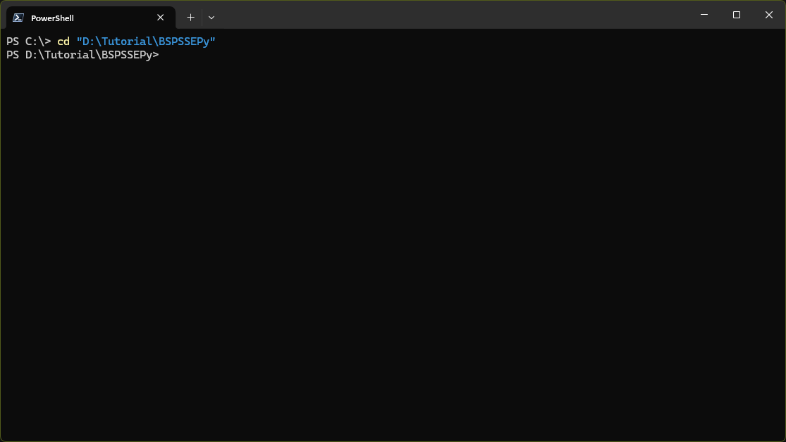
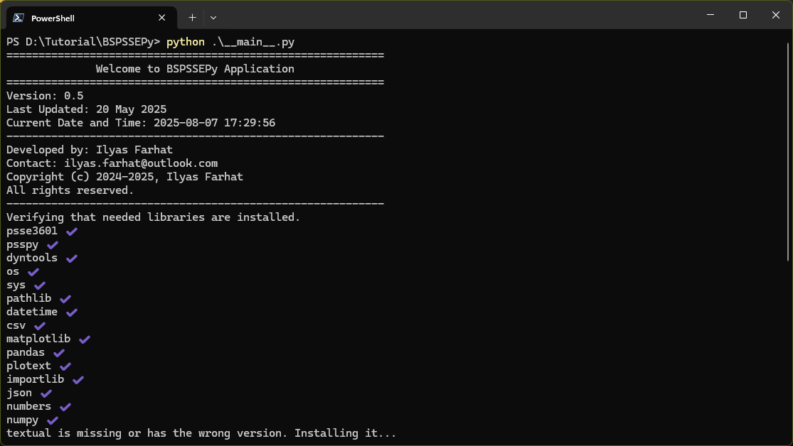
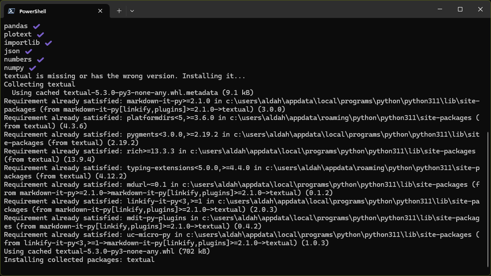
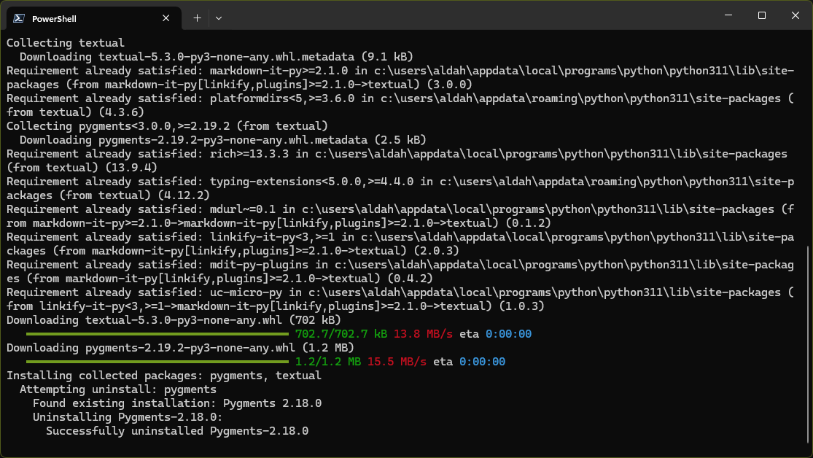
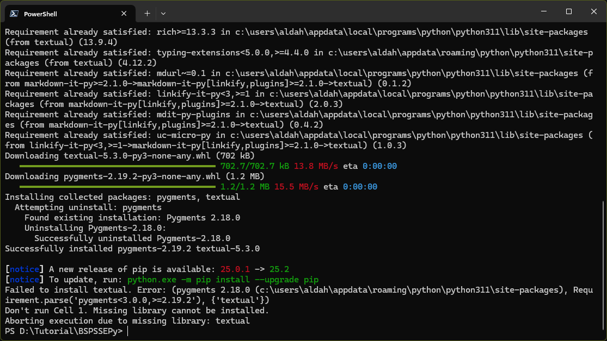
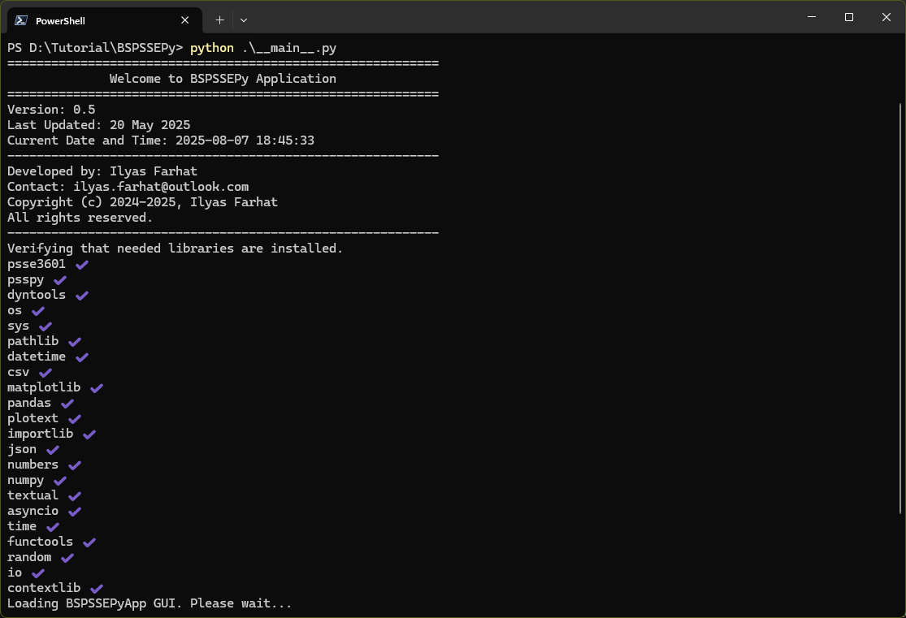
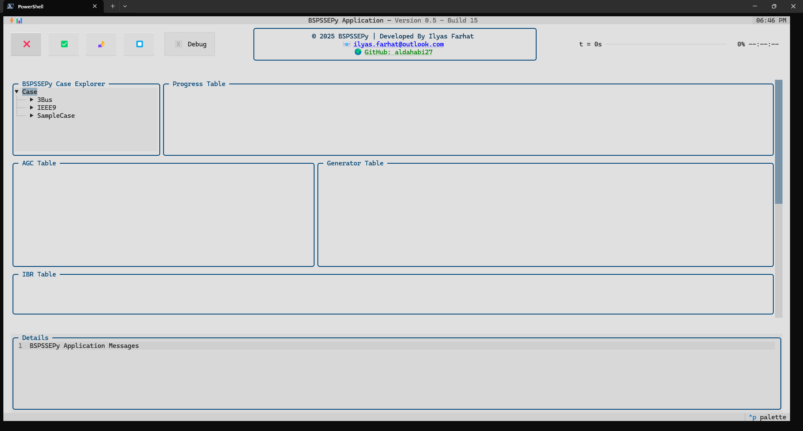

# Welcome to the BSPSSEPy Program

**Version:** 0.6  
**Last Updated:** 10 Aug 2025  
**Developed by:** Ilyas Farhat  
**Contact:** [ilyas.farhat@outlook.com](mailto:ilyas.farhat@outlook.com)  
**Copyright (c) 2024–2025**, Ilyas Farhat  
_All rights reserved._

---

## Overview

BSPSSEPy is a Black-Start simulation tool built on the PSSE Power Simulator, using the Python PSSE API to execute restoration studies. It extends PSSE’s dynamic simulation capabilities to:

* Model dynamic Black-Start phases of non-black-start generators, including cranking and ramp-up (if not already modeled in the governor).
* Execute black-start restoration plans and apply AGC during the process.
* Continuously track network elements and monitor voltage and frequency stability.

---
<div style="page-break-before: always; break-before: page;"></div>

## First-Time Setup & Download

1. **Download BSPSSEPy** from the official GitHub page: [BSPSSEPy GitHub
   Page](https://github.com/aldahabi27/BSPSSEPy)  
    
  <p align="center">
  <a href="doc/images/setup_download_github.png">
    
  </a>
  </p>


2. **Extract the ZIP package** to your preferred folder. (here we renamed the
   folder to ___BSPSSEPy___)
  <p align="center">
  <a href="doc/images/setup_extract_files.png">
    
  </a>
  </p>

3. **Open the terminal** in the BSPSSEPy main folder. This guide uses *Microsoft Windows Terminal*.

  <p align="center">
  <a href="doc/images/setup_open_terminal.png">
    
  </a>
  </p>  

> [Microsoft Store Link – Windows Terminal](https://apps.microsoft.com/detail/9n0dx20hk701)
   
---
<div style="page-break-before: always; break-before: page;"></div>

## Prerequisites

Before running BSPSSEPy for the first time, ensure you have:

1. **PSSE Version 36.1**
2. **Python 3.11.9** (installed via PSSE installer)
3. **Required Python Libraries**

BSPSSEPy will automatically check for missing libraries and attempt to install
them. However, ensure you have these core Python modules preinstalled
(_usually are installed by default with Python_):

* `subprocess`
* `sys`

**Additional required libraries (_will be auto-installed_):**

1. `psse3601`
2. `psspy`
3. `dyntools`
4. `os`
5. `sys`
6. `pathlib`
7. `datetime`
8. `csv`
9. `matplotlib`
10. `pandas`
11. `plotext`
12. `importlib`
13. `json`
14. `numbers`
15. `numpy`
16. `textual`

---
<div style="page-break-before: always; break-before: page;"></div>

## First Run – Installing Libraries

1. **Navigate to BSPSSEPy folder in Terminal**
```bash
cd "D:\Tutorial\BSPSSEPy"
```
___note: Replace the directory with your BSPSSEPy directory___

  <p align="center">
  <a href="doc/images/run_navigate_terminal.png">
    
  </a>
  </p> 

2. **Run the program**

```bash
python .\__main__.py
```

  <p align="center">
  <a href="doc/images/run_first_launch.png">
    
  </a>
  </p> 

3. **Library check and installation process**
  <p align="center">
  <a href="doc/images/run_checking_libraries.png">
    
  </a>
  </p> 

  <p align="center">
  <a href="doc/images/run_installing_libraries.png">
    
  </a>
  </p> 

  <p align="center">
  <a href="doc/images/run_bug_warning.png">
    
  </a>
  </p> 

4. **Restart after installation (_if error shows up_)**

```bash
python .\__main__.py
```
  <p align="center">
  <a href="doc/images/run_all_loaded.png">
    
  </a>
  </p> 

  <p align="center">
  <a href="doc/images/run_gui_loaded.png">
    
  </a>
  </p> 

---
<div style="page-break-before: always; break-before: page;"></div>

## Running a Simulation

---

### Case Folder Layout

Each study case lives in its own subfolder under `case/`, with files sharing the same base name:

```
case/IEEE9/
  IEEE9_Ver1.sav
  IEEE9_Ver1.dyr
  IEEE9_Ver1_Config.py
  IEEE9_Ver1_Conv.py
  IEEE9_Ver1.csv
```

---
<div style="page-break-before: always; break-before: page;"></div>

### Step 1: Prepare Power System Case Files

Prepare a `.sav` power system case file and a `.dyr` dynamic data file in PSSE. Ensure:

* **All device names** in the case match the names in your BSPSSEPy control plan CSV (more on that later).
* Follow the recommended naming convention:

| Element Type                             | Naming Pattern | Description & Rules                                                                                                                                                                          |
| ---------------------------------------- | -------------- | -------------------------------------------------------------------------------------------------------------------------------------------------------------------------------------------- |
| **Generator**                            | `GEN#@`        | `#` = bus number. `@` = device order at that bus (`A`, `B`, `C`, ...). Example: `GEN55A`, `GEN55B`.                                                                                          |
| **Branch (Transmission Line)**           | `BRN#_#@`      | `#_#` = `from_bus` **underscore** `to_bus`. **Always** write the smaller bus number first (`min_bus_max_bus`). Example: line between 4 and 15 is `BRN4_15A` (even if power flows from 15→4). |
| **Two‑Winding Transformer (2W TF)**      | `TWTF#_#@`     | Same ordering rule as branches: `TWTFmin_bus_max_bus@`. Example: `TWTF7_13A`.                                                                                                                |
| **Load**                                 | `LOAD#@`       | `#` = bus number; `@` = device order. Example: `LOAD15A`, `LOAD15B`.                                                                                                                         |
| **Battery Energy Storage System (BESS)** | `BESS#@`       | `#` = bus number; `@` = device order. Example: `BESS5A`.                                                                                                                                     |

  
> **Device order (`@`) guidance:** Use `A, B, C, ...` for parallel units at the same bus. If you exceed 26, continue with `AA, AB, ...`.
>
> * Currently, only **two-winding transformers** are supported. For other transformer types, use a clear naming scheme and update BSPSSEPy accordingly.
> * BESS can be generalized to other IBRs with code adjustments.
> * If only one element is present at a bus __DON'T PUT A LETTER SUFFIX__

Optional but recommended: prepare an **SLD file** in PSSE for better visualization during analysis.

---
<div style="page-break-before: always; break-before: page;"></div>

### Step 2: BSPSSEPy Config File (drop‑in template)

Name this file to match your case, e.g. `IEEE9_Ver1_Config.py` (or `IEEE9_Config.py` if you only have one variant). Adjust the values to your study.

```python
"""
BSPSSEPy case configuration file.

Edit values to match your PSSE case and study needs. This file is imported by
BSPSSEPy at runtime; keep variable names in snake_case.
"""

# -------------------------
# Core case identification
# -------------------------
case_name = "IEEE9"  # Should match the name of the case folder exactly.

# Version number from the .sav file name (e.g., 3Bus_Ver2.sav). Use -1 if no version is specified.
ver = 1

# Number of buses in the system. If unsure, leave as 0, and the code will derive this automatically from the case data.
num_of_buses = 50

# -------------------------
# Channel / monitoring setup
# -------------------------
# Specify buses to monitor voltage as a list of bus numbers.
# Use 'Range(start, end)' syntax to indicate a range of buses.
# Flag 'v_flag' may override this setting when non-zero.
v_buses_to_monitor = range(1, 10)

# Specify buses to monitor frequency as a list of bus numbers.
# Flag 'freq_flag' may override this setting when non-zero.
freq_buses_to_monitor = [1, 2, 3, 5]

# Flag for voltage monitoring behavior (not active yet):
# 0 = use specified buses, 1 = all generator buses,
# 2 = all transformer buses, 3 = gen+TF buses,
# 4 = all load buses, 5 = all buses.
v_flag = 0

# Flag for frequency monitoring behavior (not active yet):
# 0 = use specified buses, 1 = all generator buses,
# 2 = all transformer buses, 3 = gen+TF buses,
# 4 = all load buses, 5 = all buses.
freq_flag = 0

# -------------------------
# Simulation timing
# -------------------------
# Time step for the simulation in seconds. Default is 1ms (0.001).
sim_time_step = 1e-3  # seconds

# Frequency filtering threshold for simulation in seconds. Default is 4 × sim_time_step.
sim_freq_filter = 4 * sim_time_step

# Maximum iterations allowed for PSSE Newton-Raphson solver. Default is 100.
psse_max_iter_newton_raphson = 100

# File regeneration (CNV/SNP)
# If True, forces regeneration regardless of file existence; if False, reuses existing when present.
ignore_cnv_file = True
ignore_snp_file = True

# -------------------------
# BSPSSEPy supervisor timing
# -------------------------
# BSPSSEPy Hard Time Limit in minutes (ignored if bspssepy_hard_time_limit_flag is False)
bspssepy_hard_time_limit = 10  # minutes

# If True, enforce a hard wall-clock limit on the simulation; if False, no hard limit.
bspssepy_hard_time_limit_flag = True

# BSPSSEPy Time Step in seconds
# This timestep controls the Python supervisor execution rate (AGC, actions, etc.).
# Note: This is different from the PSSE dynamic time step (sim_time_step).
bspssepy_time_step = 1  # seconds

# Controls the frequency of progress print messages (minutes).
bspssepy_progress_print_time = 1  # minutes

# -------------------------
# Generator configuration table
# -------------------------
# Each generator dictionary in `gen_config` must define:
#
# - Generator Name (str): Unique generator ID in PSSE & BSPSSEPy. Must match .sav/.dyr exactly.
# - Bus Name (str): PSSE bus name where generator is connected.
# - Status (int): Initial state: 0 OFF, 1 Cranking, 2 Ramp-up, 3 Ready/Active.
#   * For BS units, this is auto-forced to 3 at runtime.
# - load Name (str): Name of the corresponding cranking load, if any.
# - Cranking Time (float): Time for cranking phase, in minutes.
# - Ramp Rate (float): Ramp-up rate in MW/min; ignored if UseGenRampRate=False.
# - Generator Type (str): "BS" for black-start, "NBS" for non-black-start.
# - Cranking load Array (list[float]): [PL, QL, IP, IQ, YP, YQ, PF]
#     PL (MW)  – Constant power P
#     QL (MVAr) – Constant power Q
#     IP – Constant current P
#     IQ – Constant current Q
#     YP – Constant admittance P
#     YQ – Constant admittance Q
#     PF – Power factor (optional)
#     * For BS units, set all to zero.
# - AGC Participation Factor (float): Share of AGC regulation (sum over gens ≈ 1.0).
# - load Damping Constant (float): Damping constant D for frequency response.
# - Effective Speed Droop (float): Droop R in p.u. (e.g., 0.05 for 5%).
# - Bias Scaling (float): Multiplier on AGC bias term.
# - POPF (float): Governor power reference (MW).
# - QOPF (float): Voltage/reactive reference (MVAr).
# - UseGenRampRate (bool): True ⇒ use config Ramp Rate; False ⇒ use model's internal ramp rate.
# - Load Enabled Response (bool): True ⇒ output adjusts for anticipated load connection, using LERPF.
# - LERPF (float): Load Enabled Response Participation Factor. -1 ⇒ use AGC PF; 0–1 ⇒ explicit share.
# - Inertia Constant (float): H in seconds, representing kinetic energy in rotor mass.

gen_config = [
    {
        "Generator Name": "GEN1",
        "Bus Name": "Bus1",
        "Status": 3,  # BS unit ⇒ status forced to 3 internally (Ready/Active)
        "load Name": "CLGEN1",
        "Cranking Time": 4.0,       # minutes
        "Ramp Rate": 0.2 * 247.5,   # MW/min
        "Generator Type": "BS",    # BS or NBS
        "Cranking load Array": [0, 0, 0, 0, 0, 0],  # BS ⇒ no cranking load used
        "AGC Participation Factor": 1,   # share for AGC distribution (e.g., 1/3)
        "load Damping Constant": 0,      # D
        "Effective Speed Droop": 0.05,   # R
        "Bias Scaling": 1,               # Effective Bias = Bias * Bias Scaling
        "POPF": 45.8217,  # Governor reference (MW)
        "QOPF": -42.6377, # Voltage/reactive reference (MVAr)
        "UseGenRampRate": False,  # True ⇒ use config Ramp Rate; False ⇒ use model limits
        "Load Enabled Response": False,  # True ⇒ supply based on anticipated load-enabled using LERPF
        "LERPF": -1,  # -1 ⇒ use AGC PF; else 0≤LERPF≤1 and sum over gens = 1
        "Inertia Constant": 13.7363,  # H (s)
    },
    {
        "Generator Name": "GEN2",
        "Bus Name": "Bus2",
        "Status": 0,  # NBS initially OFF
        "load Name": "CLGEN2",
        "Cranking Time": 60,        # minutes
        "Ramp Rate": 0.2 * 192,     # MW/min
        "Generator Type": "NBS",
        # "Cranking load Array": [0.05, 0.02, 0, 0, 0, 0],
        "Cranking load Array": [9.6, 0, 0, 0, 0, 0],
        "AGC Participation Factor": 0,
        "load Damping Constant": 0,
        "Effective Speed Droop": 0.05,
        "Bias Scaling": 1,
        "POPF": 0,       # MW governor reference (set if pre-scheduling P)
        "QOPF": -39.7548,
        "UseGenRampRate": False,  # True ⇒ use config Ramp Rate; False ⇒ use model limits
        "Load Enabled Response": False,
        "LERPF": -1,
        "Inertia Constant": 8.3136,
    },
    {
        "Generator Name": "GEN3",
        "Bus Name": "Bus3",
        "Status": 0,  # NBS initially OFF
        "load Name": "CLGEN3",
        "Cranking Time": 40,        # minutes
        "Ramp Rate": 0.1 * 128,     # MW/min
        "Generator Type": "NBS",
        # "Cranking load Array": [0.03, 0.05, 0, 0, 0, 0],
        "Cranking load Array": [3.84, 0, 0, 0, 0, 0],
        "AGC Participation Factor": 0,
        "load Damping Constant": 0,
        "Effective Speed Droop": 0.05,
        "Bias Scaling": 1,
        "POPF": 0,       # MW governor reference (set if pre-scheduling P)
        "QOPF": -45.8050,
        "UseGenRampRate": False,
        "Load Enabled Response": False,
        "LERPF": -1,
        "Inertia Constant": 4.2880,
    },
    # Add more generators as needed
]

# -------------------------
# IBRs Configuration
# -------------------------
ibr_config = [
    {
        "IBR Name": "BESS5",
        "Bus Name": "Bus5",
        "Status": 0,  # 0: OFF, 1: Online
        "IBR Type": "BESS",  # e.g., BESS, Wind, Solar (extend if needed)
        "Ramp Rate": 0,  # Placeholder; currently rely on dynamic model
        "GFM Flag": True,  # True ⇒ operate in GFM mode (handled in .dyr)
        "Initial Capacity": 0.2,  # p.u. of MBASE
    }
]

# -------------------------
# Supervisor and safety logic
# -------------------------
# Debug print flag. True ⇒ emit [DEBUG] messages; False ⇒ quiet.
debug_print = True
# DebugPrintFlag = False  # (legacy name kept for reference)

# Flag to enforce action lock logic.
# True ⇒ no concurrent actions (sequential execution guaranteed).
# False ⇒ actions may overlap when time-aligned.
enforce_action_lock = False

# Execute tied actions with their parent action regardless of lock status.
# True ⇒ "tied" actions execute with the parent even if enforce_action_lock is True.
# False ⇒ tied actions follow normal scheduling/locking.
bypass_tied_actions = False

# Execute the control sequence exactly as listed (ignore action times).
# True ⇒ ignore timestamps; requires enforce_action_lock = True.
# False ⇒ schedule by action time (default behavior).
control_sequence_as_is = False

# Adjust action timings to compensate for execution delays (AGC settling,
# generator startup, etc.) while preserving intended gaps.
account_for_action_exec_delays = True

# Enforce frequency safety margins.
# True ⇒ hold next action until frequency is within [min, max].
# False ⇒ proceed regardless of frequency.
enforce_freq_safety_margin = True
# Bounds (Hz) if enforce_freq_safety_margin is True:
freq_safety_margin_min = 59.5
freq_safety_margin_max = 60.5

# If enforce_freq_safety_margin is True, BSPSSEPy waits for AGC to restore
# frequency to within limits before executing the next action. If False,
# scheduling ignores frequency bounds.

# Tie actions by their execution time. If actions are also tied by value fields,
# they will be grouped under the parent.
tie_actions_by_exec_time = True

# Delay after each action before AGC re-engages (seconds).
delay_agc_after_action = 30
```

---
<div style="page-break-before: always; break-before: page;"></div>

### Step 3: PSSE Dynamic Conversion File Example

Save as `IEEE9_Ver1_Conv.py` (or without version number if only one case).

```python
# This file contains the PSSE conversion commands for the case.
# Conversion is required to prepare dynamic simulation models after solving power flow.

# Apply fixed-slope decoupled Newton-Raphson power flow calculation.
psspy.fdns([1, 0, 1, 1, 1, 0, 99, 0])

# Convert all generators for dynamic simulation.
psspy.cong(0)

# Initialize for load conversion, then convert loads to dynamic models.
# Mode 1: convert constant power loads.
psspy.conl(0, 1, 1, [0, 0], [0, 0, 0, 0])
# Mode 2: convert constant current loads.
psspy.conl(0, 1, 2, [0, 0], [0, 0, 0, 0])
# Mode 3: convert constant impedance loads.
psspy.conl(0, 1, 3, [0, 0], [0, 0, 0, 0])

# Postprocessing: order network elements for simulation.
psspy.ordr(0)  # Orders buses, branches, and components for numerical stability.
psspy.fact()   # Factorizes the admittance matrix for use in dynamic simulation.
psspy.tysl(0)  # Builds and stores the system solution matrix for time simulation.
psspy.tysl(0)  # Repeats to ensure full update after conversion.
```

---
<div style="page-break-before: always; break-before: page;"></div>

### Step 4: BSPSSEPy CSV Plan

The CSV plan defines the chronological sequence of actions during the simulation.

**File name format:**

```
<case_name>_Ver<version>.csv
```

If only one version exists, omit `_Ver<version>`.

**Example:**

```
IEEE9_Ver1.csv
```

---

**Sample Content:**

| Device Type | Identification Type | Identification Value | Action Type | Action Time | Action Status | Values         |
| ----------- | ------------------- | -------------------- | ----------- | ----------- | ------------- | -------------- |
| TRN         | NAME                | TWTF1\_4             | ON          | 2           | 0             | {}             |
| LOAD        | NAME                | LOAD4B               | ON          | 2.016666667 | 0             | {}             |
| GEN         | NAME                | GEN1                 | UPDATE      | 2.033333333 | 0             | {'P': 8}       |
| LOAD        | NAME                | LOAD4A               | ON          | 4           | 0             | {}             |
| GEN         | NAME                | GEN1                 | UPDATE      | 4.016666667 | 0             | {'P': 13}      |
| BRN         | NAME                | BRN4\_5              | ON          | 6           | 0             | {}             |
| LOAD        | NAME                | LOAD5D               | ON          | 6.016666667 | 0             | {}             |
| BESS        | NAME                | BESS5                | ON          | 6.033333333 | 0             | {}             |
| GEN         | NAME                | GEN1                 | UPDATE      | 6.05        | 0             | {'P': 20.9372} |
| BESS        | NAME                | BESS5                | UPDATE      | 6.066666667 | 0             | {'P': 5.0628}  |
| GEN         | NAME                | GEN1                 | UPDATE      | 8           | 0             | {'P': 30.2399} |
| BESS        | NAME                | BESS5                | UPDATE      | 8.05        | 0             | {'P': -4.2399} |

---

**Column Descriptions:**

* **Device Type:** TRN (Transformer), LOAD, GEN, BRN (Branch), BESS.
* **Identification Type:** Typically `NAME`, but can be other identifier types
  supported by BSPSSEPy (Refer to Code Help documentation).
* **Identification Value:** Exact device name following the naming scheme.
* **Action Type:** Operation to perform (ON, OFF, UPDATE, etc.).
* **Action Time:** Time in minutes from simulation start to perform the action.
* **Action Status:** Reserved for runtime flags or internal state tracking
  (keep it 0 for Black-Start Simulations).
* **Values:** Dictionary of parameters to change (e.g., `{'P': 8}` to set generator active power to 8 MW).
---
<div style="page-break-before: always; break-before: page;"></div>

## IEEE9 Bus System Complete Example – Full Case Study (2 Versions)

**Version 1 (Ver1) – No BESS**

To run a full Black-Start simulation for the IEEE 9-Bus System in BSPSSEPy, you will need the following six files:

1. IEEE9\_Ver1.sav  – PSSE saved case file.
2. IEEE9\_Ver1.dyr  – Dynamic data file.
3. IEEE9\_Ver1.sld  – PSSE one-line diagram file (not used in BSPSSEPy, but
   good to have it).
4. IEEE9\_Ver1.csv  – Simulation control plan.
5. IEEE9\_Ver1\_Config.py – Configuration script.
6. IEEE9\_Ver1\_Conv.py   – Converter or helper script.

### Preparing PSSE Files (sav, dyr, sld) for the Case Study (Ver1)

We will follow a step-by-step approach to build the IEEE 9-Bus case in PSSE from scratch:

<div style="page-break-before: always; break-before: page;"></div>

**Step 1 — Launch PSSE**  
Open the PSSE application. You should see the default start page, showing the Study Project Tasks pane with the option to create a new study project.

<p align="center"> <a href="doc/images/ieee9_ver1/00 PSSE - IEEE9_Ver1.png">  </a> </p>

---
<div style="page-break-before: always; break-before: page;"></div>

**Step 2 — Create a New Case**  
Click on the **New** icon in the toolbar (highlighted in red in the screenshot) to start creating a new PSSE case.

<p align="center">  
  <a href="doc/images/ieee9_ver1/01 PSSE - IEEE9_Ver1.png">  
      
  </a>  
</p>

---
<div style="page-break-before: always; break-before: page;"></div>

**Step 3 — Select Case Data**  
In the *New* dialog, choose **Case Data** from the list of options, then click **OK** to proceed.

<p align="center">  
  <a href="doc/images/ieee9_ver1/02 PSSE - IEEE9_Ver1.png">  
      
  </a>  
</p>

---
<div style="page-break-before: always; break-before: page;"></div>

**Step 4 — Set Base Parameters**  
In the *Build New Case* dialog, set the **Base Frequency** to `60` Hz and confirm the **Base MVA** value (default `100.00`). Leave other fields at their default settings, then click **OK** to create the new case.

<p align="center">  
  <a href="doc/images/ieee9_ver1/03 PSSE - IEEE9_Ver1.png">  
      
  </a>  
</p>

---
<div style="page-break-before: always; break-before: page;"></div>

**Step 5 — Empty Case Ready**
After setting the base parameters, PSSE will open a new case window. This case is currently empty, ready for you to start building your network model.

<p align="center">  
  <a href="doc/images/ieee9_ver1/04 PSSE - IEEE9_Ver1.png">  
      
  </a>  
</p>

---
<div style="page-break-before: always; break-before: page;"></div>

**Step 6 — Preparing to Populate Network Data Tables**  
We will now begin entering the bus, machine, and load data into the case. These tables will be filled one by one using the provided Excel file.

[Click here to open the IEEE9 Example Tables Excel file](doc/IEEE9_Example_Tables.xlsx)

You will use this file to copy the table contents directly into PSSE, rather
than typing them manually.

<p align="center">  
  <a href="doc/images/ieee9_ver1/05 PSSE - IEEE9_Ver1.png">  
      
  </a>  
</p>

---
<div style="page-break-before: always; break-before: page;"></div>

**Step 7 — Copy and Paste the Bus Table into PSSE**  
In `IEEE9_Example_Tables.xlsx`, while on the **IEEE9\_Ver1.sav** sheet, locate the **Buses Table**. Select the entire table content **without the header row**. The header usually contains labels like *Bus Number*, *Base kV*, *Area*, etc., and should not be copied. Once selected, copy the data (**Ctrl+C**).

<p align="center">  
  <a href="doc/images/ieee9_ver1/06 PSSE - IEEE9_Ver1.png">  
      
  </a>  
</p>

Back in PSSE, ensure you are on the **Bus** tab in the *Network data* section.
Click on the **first empty cell** in the table, then paste the copied values
(**Ctrl+V**).

<p align="center">  
  <a href="doc/images/ieee9_ver1/07 PSSE - IEEE9_Ver1.png">  
      
  </a>  
</p>

This will insert the bus data directly into the case.

<p align="center">  
  <a href="doc/images/ieee9_ver1/08 PSSE - IEEE9_Ver1.png">  
      
  </a>  
</p>

---
<div style="page-break-before: always; break-before: page;"></div>

**Step 8 — Copy and Paste the Machine Table into PSSE**  
In `IEEE9_Example_Tables.xlsx`, ensure you are still on the **IEEE9\_Ver1.sav** sheet. Locate the **Machine Table**. Select the entire table content **without the header row**, then copy the data (**Ctrl+C**).

Back in PSSE, go to the **Machine** tab in the *Network data* section. Click on the **first empty cell** in the table, then paste the copied values (**Ctrl+V**). This will insert the machine data directly into the case.

<p align="center">  
  <a href="doc/images/ieee9_ver1/09 PSSE - IEEE9_Ver1.png">  
      
  </a>  
</p>

---
<div style="page-break-before: always; break-before: page;"></div>

**Step 9 — Copy and Paste the Load Table into PSSE**  
In `IEEE9_Example_Tables.xlsx`, ensure you are still on the **IEEE9\_Ver1.sav** sheet. Locate the **Load Table**. Select the entire table content **without the header row**, then copy the data (**Ctrl+C**).

Back in PSSE, go to the **Load** tab in the *Network data* section. Click on the **first empty cell** in the table, then paste the copied values (**Ctrl+V**). This will insert the load data directly into the case.

<p align="center">  
  <a href="doc/images/ieee9_ver1/10 PSSE - IEEE9_Ver1.png">  
      
  </a>  
</p>

---
<div style="page-break-before: always; break-before: page;"></div>

**Step 10 — *Important Note on Generator Bus Codes***  
*After pasting the machines table earlier, some buses might have had their **Code** values changed automatically by PSSE. For blackout simulation purposes, generator buses should be modeled as "islands," meaning they must be set as swing buses for their respective area/island. Double-check that all generator buses have **Code 2 or 3** assigned.*

<p align="center">  
  <a href="doc/images/ieee9_ver1/11 PSSE - IEEE9_Ver1.png">  
      
  </a>  
</p>

---
<div style="page-break-before: always; break-before: page;"></div>

**Step 11 — Copy and Paste the AC Line Table into PSSE**  
In `IEEE9_Example_Tables.xlsx`, while still on the **IEEE9\_Ver1.sav** sheet, locate the **Branch > AC Line** table. Select the entire table content **without the header row**, then copy the data (**Ctrl+C**).

Back in PSSE, go to the **Branch** tab group and select the **AC Line** tab. Click on the **first empty cell** in the table, then paste the copied values (**Ctrl+V**). This will insert the AC line data directly into the case.

<p align="center">  
  <a href="doc/images/ieee9_ver1/12 PSSE - IEEE9_Ver1.png">  
      
  </a>  
</p>

---
<div style="page-break-before: always; break-before: page;"></div>

**Step 12 — Copy and Paste the 2 Winding Transformer Table into PSSE**  
In `IEEE9_Example_Tables.xlsx`, while still on the **IEEE9\_Ver1.sav** sheet, locate the **Branch > 2 Winding** table. Select the entire table content **without the header row**, then copy the data (**Ctrl+C**).

Back in PSSE, go to the **Branch** tab group and select the **2 Winding** tab. Click on the **first empty cell** in the table, then paste the copied values (**Ctrl+V**). This will insert the transformer data directly into the case.

<p align="center">  
  <a href="doc/images/ieee9_ver1/13 PSSE - IEEE9_Ver1.png">  
      
  </a>  
</p>

---
<div style="page-break-before: always; break-before: page;"></div>

**Step 13 — Save the Case File**  

1. In PSSE, click the **Save** button (toolbar icon or `File > Save`).

<p align="center">  
  <a href="doc/images/ieee9_ver1/14 PSSE - IEEE9_Ver1.png">  
      
  </a>  
</p>

1. In the **Save Network Data** dialog, select the **Case Data** tab.
2. Set the **case name** to `IEEE9_Ver1`.
3. Click on `...` to set the save location.
4. Navigate to the **case** folder inside your **BSPSSEPy** directory.
5. Click on `New folder`.
6. Create a **new folder** named after the main case name (e.g., `IEEE9`, without the version number).
7. Open this folder.
8. Save the `.sav` file inside it by clicking **Save**.
9. Click **OK** to confirm in the dialog.

<p align="center">  
  <a href="doc/images/ieee9_ver1/15 PSSE - IEEE9_Ver1.png">  
      
  </a>  
</p>

Once saved, check the Output Bar in PSSE to confirm the message: **Case saved in file** followed by the correct path, ensuring the file is in the intended location.

<p align="center">  
  <a href="doc/images/ieee9_ver1/16 PSSE - IEEE9_Ver1.png">  
      
  </a>  
</p>

---
<div style="page-break-before: always; break-before: page;"></div>

**Step 14 — Solve the Power Flow and Confirm the Setup**

1. In PSSE, click the **Solve Power Flow** button on the toolbar.

<p align="center">  
  <a href="doc/images/ieee9_ver1/17 PSSE - IEEE9_Ver1.png">  
      
  </a>  
</p>

2. In the **Power Flow Solutions** window:

   * Select the **Newton** tab.
   * Select **Flat start**.
   * Click **Solve**.

<p align="center">  
  <a href="doc/images/ieee9_ver1/18 PSSE - IEEE9_Ver1.png">  
      
  </a>  
</p>

3. Confirm that the system converged:

   * Look for **Met convergence tolerances** (green box) in the status bar.
   * Ensure the **largest mismatch** value is small.

<p align="center">  
  <a href="doc/images/ieee9_ver1/19 PSSE - IEEE9_Ver1.png">  
      
  </a>  
</p>

4. (Optional) For better accuracy:

   * Change **Flat start** to **Do not flat start**.
   * Solve again multiple times until the mismatch is minimal.

<p align="center">  
  <a href="doc/images/ieee9_ver1/20 PSSE - IEEE9_Ver1.png">  
      
  </a>  
</p>

5. Save the updated, solved case file.

<p align="center">  
  <a href="doc/images/ieee9_ver1/21 PSSE - IEEE9_Ver1.png">  
      
  </a>  
</p>

---
<div style="page-break-before: always; break-before: page;"></div>

**Step 15 — Setup the Dynamic DYR File Configuration**  
1. In PSSE, click the **Dynamics Spreadsheet** icon to begin setting up the dynamics configurations.

<p align="center">  
  <a href="doc/images/ieee9_ver1/22 PSSE - IEEE9_Ver1.png">  
      
  </a>  
</p>

2. This will open the Dynamics Data view. Currently, the DYR file is empty, meaning no dynamic models have been set up yet for the generators.

<p align="center">  
  <a href="doc/images/ieee9_ver1/23 PSSE - IEEE9_Ver1.png">  
      
  </a>  
</p>

3. We will populate the generators’ model parameters from the provided Excel spreadsheet in the next steps.
   *[Click here to open the IEEE9 Example Tables Excel file](doc/IEEE9_Example_Tables.xlsx)*

---
<div style="page-break-before: always; break-before: page;"></div>

**Step 16 — Assign Generator Model Parameters**  
1. **Select Generator Model** — Double-click the generator model cell for the desired machine.

<p align="center">  
  <a href="doc/images/ieee9_ver1/24 PSSE - IEEE9_Ver1.png">  
      
  </a>  
</p>

2. **Open Model Parameters Window** — After selecting the model, the parameter window should appear.

<p align="center">  
  <a href="doc/images/ieee9_ver1/25 PSSE - IEEE9_Ver1.png">  
      
  </a>  
</p>

3. **Get Data from Excel File** — Open the provided Excel file, switch to the *IEEE9\_Ver1.dyr* sheet, and select the data corresponding to the current tab in the model parameters window. Copy the data only.

<p align="center">  
  <a href="doc/images/ieee9_ver1/26 PSSE - IEEE9_Ver1.png">  
      
  </a>  
</p>

4. **Paste Data into PSSE** — Highlight the first cell in the model parameters window and paste the copied data. Ensure it aligns correctly. Repeat this process for the remaining tabs (**ICONs**, **VARS**, **STATES**). Once complete, click **OK**. The model should now appear as active.

<p align="center">  
  <a href="doc/images/ieee9_ver1/27 PSSE - IEEE9_Ver1.png">  
      
  </a>  
</p>

---
<div style="page-break-before: always; break-before: page;"></div>

**Step 17 — Assign Exciter Model Parameters**  

1. **Confirm Generator Model is Active** — Ensure the generator model cell now shows the assigned model name.
2. **Select Exciter Model** — Double-click the exciter model cell for the desired machine.
3. **Repeat Parameter Assignment Procedure** — Follow the same procedure as with the generator model: open the parameter window, copy data from the Excel file for the corresponding tabs (**CONs**, **ICONs**, **VARS**, **STATES**), paste into PSSE, and click **OK**.

<p align="center">  
  <a href="doc/images/ieee9_ver1/28 PSSE - IEEE9_Ver1.png">  
      
  </a>  
</p>

---
<div style="page-break-before: always; break-before: page;"></div>

**Step 18 — Assign Turbine Governor Model Parameters**  

1. **Select the Appropriate Governor Model** — Double‑click the *Turbine
   Governor* cell for the desired machine and choose the correct model from
   the list.
   
<p align="center">  
  <a href="doc/images/ieee9_ver1/29 PSSE - IEEE9_Ver1.png">  
      
  </a>  
</p>

2. **Skip Linked Machine Setup (If Not Applicable)** — If a pop‑up window
   appears for linked machine configuration (e.g., for hydro units with shared
   sources) and your system does not include such links, click **Cancel**.

<p align="center">  
  <a href="doc/images/ieee9_ver1/30 PSSE - IEEE9_Ver1.png">  
      
  </a>  
</p>


3. **Enter Model Parameters** — Open the parameter window, copy the relevant
   data from the Excel file for all required tabs (**CONs**, **ICONs**,
   **VARS**, **STATES**), and paste into PSSE.

<p align="center">  
  <a href="doc/images/ieee9_ver1/31 PSSE - IEEE9_Ver1.png">  
      
  </a>  
</p>


4. **Acknowledge Warnings** — If a warning message appears after data entry, review the content and click **OK** to proceed if the configuration is acceptable.


<p align="center">  
  <a href="doc/images/ieee9_ver1/32 PSSE - IEEE9_Ver1.png">  
      
  </a>  
</p>

---
<div style="page-break-before: always; break-before: page;"></div>

**Step 19 — Finalize Model Assignments and Save DYR File**  

1. **Repeat for Remaining Generators** — Apply the same procedure used for
   Generator 1 to set up the generator, exciter, and turbine governor models
   for Generator 2 and Generator 3.

<p align="center">  
  <a href="doc/images/ieee9_ver1/33 PSSE - IEEE9_Ver1.png">  
      
  </a>  
</p>

2. **Confirm Model Activation** — Ensure all three generators show the correct
   models assigned in their respective columns.

<p align="center">  
  <a href="doc/images/ieee9_ver1/34 PSSE - IEEE9_Ver1.png">  
      
  </a>  
</p>

3. **Save the Dynamic Data File (DYR)** — Once all models are set, save the *.dyr* file to preserve the dynamic model configuration.

<p align="center">  
  <a href="doc/images/ieee9_ver1/35 PSSE - IEEE9_Ver1.png">  
      
  </a>  
</p>

---
<div style="page-break-before: always; break-before: page;"></div>

**Step 20 — Prepare Case Files for BSPSSEPy**  
At this stage, the PSSE-related files needed to run the dynamic simulation in BSPSSEPy are ready. Specifically, you should have the following files saved in your `case/IEEE9` directory:

* **IEEE9\_Ver1.sav** — The network case file.
* **IEEE9\_Ver1.dyr** — The dynamic data file.

<p align="center">  
  <a href="doc/images/ieee9_ver1/36 PSSE - IEEE9_Ver1.png">  
      
  </a>  
</p>

Next, you will need the **plan CSV file**, which contains the sequence of actions for the simulation. You have two options:

1. **Download or copy the provided CSV file:** [IEEE9 Version 1 Plan - CSV File](doc/IEEE9_Ver1.csv). The CSV file is available at: `doc/IEEE9_Ver1.csv`.
2. **Generate the CSV file from MAT-BS:** Contact me at *[ilyas.farhat@outlook.com](mailto:ilyas.farhat@outlook.com)* for details. (A webpage link will be added here in the future.)

Additionally, ensure you have the following Python helper scripts in your case directory:

* [IEEE9\_Ver1\_Config.py](doc/IEEE9_Ver1_Config.py) — Configuration file.
* [IEEE9\_Ver1\_Conv.py](doc/IEEE9_Ver1_Conv.py) — Converter file.

<p align="center">  
  <a href="doc/images/ieee9_ver1/37 PSSE - IEEE9_Ver1.png">  
      
  </a>  
</p>

*If you used same info/naming scheme, you may copy the sld file from here: [IEEE9_Ver1.sld](doc/IEEE9_Ver1.sld)*

---
<div style="page-break-before: always; break-before: page;"></div>

**Step 21 — Opening BSPSSEPy Program**  
Once all required files are prepared, you can now launch the BSPSSEPy program.

1. Open a terminal (Command Prompt or PowerShell).
2. Navigate to the BSPSSEPy main folder. For example:

   ```bash
   cd "C:\BSPSSEPy"
   ```
3. Run the BSPSSEPy program by executing:

   ```bash
   python .\__main__.py
   ```

<p align="center">  
  <a href="doc/images/ieee9_ver1/38 PSSE - IEEE9_Ver1.png">  
      
  </a>  
</p>

---
<div style="page-break-before: always; break-before: page;"></div>

**Step 22 — Running BSPSSEPy App**  
Run the BSPSSEPy application, select the `IEEE9_Ver1` case, and execute the plan.

<p align="center">
  <video width="800" controls>
    <source src="doc/images/ieee9_ver1/BSPSSEPy - IEEE9_Ver1.mp4" type="video/mp4">
    Your browser does not support the video tag.
  </video>
</p>

---
<div style="page-break-before: always; break-before: page;"></div>

**Step 23 — Viewing Simulation Results**  
Simulation results are saved in the `simulations` folder inside the `IEEE9` case folder within the BSPSSEPy application directory.
<p align="center">  
  <a href="doc/images/ieee9_ver1/39 PSSE - IEEE9_Ver1.png">  
      
  </a>  
</p>

Two ways to view the results:

1. **CSV Output File** — Contains all channels recorded during the simulation
   (as defined in the Config file). This file can be used with a MATLAB
   plotting script (contact me at
   [ilyas.farhat@outlook.com](mailto:ilyas.farhat@outlook.com) for details).

2. **.out File** — Contains the same measurements for plotting directly in PSS®E.

<p align="center">  
  <a href="doc/images/ieee9_ver1/40 PSSE - IEEE9_Ver1.png">  
      
  </a>  
</p>

**Viewing .out file in PSS®E:**

* Open the `simulations` folder (see image below).
* Drag and drop the `.out` file into the PSS®E window.
* In PSS®E, go to **View → Plot Tree**.
* Drag a measurement (e.g., Bus 1 frequency) into the plotting area.

<p align="center">
  <br>
  <br>
  <br>
  <br>
  <br>
  
</p>
